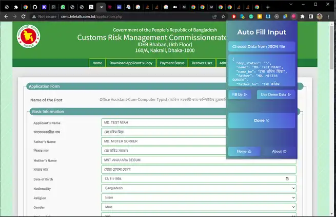

## Chrome Extension with ReactJS


## Feature 
- Basic 
- Auto fill Most Input
- Advanced features coming soon.


## Technologies 
- ReactJS
- Esbuild(Bundler tool)


### Installation  🎁🎁🎁
```shell
npm install 
npm run build 
```
or  
Just extract dist.rar and load unpack this dir


### Data Format  ✨✨✨

You have to keep original key name, because this kay name use as input id,
You can only change value for apply different candidate user.

```json lines
//json data format
{
  "dep_status": "5",
  "name": "MD. Test MIAH",
  "name_bn": "মো রহিম মিয়া",
  "father": "MD. MISTER SORKER",
  "father_bn": "মো করিম সরকার",
  "mother": "MST. ANJU ARA BEGUM",
  "mother_bn": "মোছা রেহানা বেগম",
  "dob": "1994-12-11",
  "nationality": "Bangladeshi",
  "religion": "1",
  "gender": "Male",
  "marital_status": "Married",
  "spouse_name": "MST. Alex",
  "nid": "1",
  "nid_no": "19922222222000172",
  "passport": "0",
  "breg": "1",
  "breg_no": "00009998552002160",
  "mobile": "01812345678",
  "confirm_mobile": "01812345678",
  "email": "demo.mail@gmail.com",
  "quota": "8",
  "present_careof": "MD. MISTER SORKER",
  "present_village": "WEST TEKANI",
  "present_district": "10",
  "present_upazila": "076",
  "present_post": "HORIKHALI",
  "present_postcode": "3432",
  "same_as_present": "1",
  "ssc_exam": "1",
  "ssc_roll": "888838",
  "ssc_group": "1",
  "ssc_board": "3",
  "ssc_result_type": "5",
  "ssc_result": "4.94",
  "ssc_year": "2009",
  "hsc_exam": "1",
  "hsc_roll": "993234",
  "hsc_group": "1",
  "hsc_board": "3",
  "hsc_result_type": "5",
  "hsc_result": "5.0",
  "hsc_year": "2011",
  "other_exp[0][value]": "1"
}
```


NB: This extension only works for this types website -
http://[departmentName].teletalk.com.bd/application.php


#### Preview 
